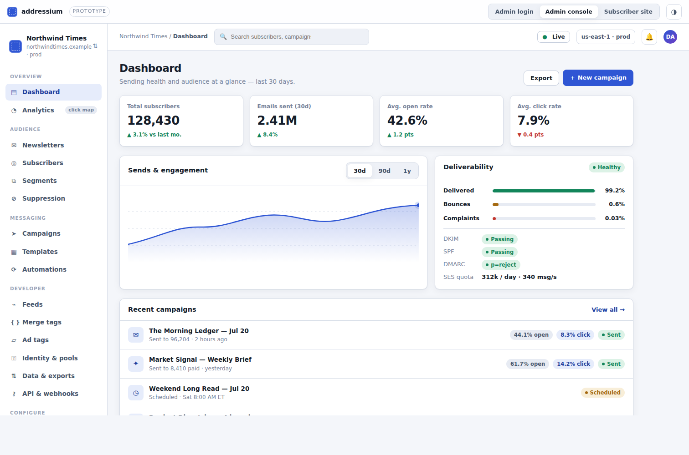

# addressium

A self-hosted replacement for the **email capabilities of Amazon Pinpoint**,
which [sunsets on 30 October 2026](https://docs.aws.amazon.com/general/latest/gr/sunset_services.html).

Runs entirely in **your** AWS account. You own the subscriber data (DynamoDB in
your account) and you own the sending reputation (your own SES identity). Not a
hosted SaaS — one deployment runs one or many **organizations**, all operated by
the same owner.



> **Live demo:** the click-through UI at **<https://addressium.com/>** (or
> [`demo/index.html`](demo/index.html) locally) — a static, no-backend prototype
> with sample data.

> ### ⚠️ Status: pre-1.0, not production-ready
> This has **never been deployed to a real AWS account**. See
> [Status](#status) before putting a real list near it.

---

## What it does

| | |
|---|---|
| **Lists & subscribers** | Double opt-in with consent provenance (timestamp, IP, source URL) |
| **Campaigns** | Compose, schedule (now / at / recurring), send, pause, resume — never delete |
| **RSS → newsletter** | Point it at an XML feed; each edition is built and sent automatically |
| **Segments** | Dynamic predicates over attributes and engagement |
| **Drip sequences** | Multi-step journeys with waits measured in days |
| **Re-engagement & sunset** | Win-back sequence, then a clean unsubscribe for the unreachable |
| **Reporting** | Opens, clicks, bounces, complaints, unsubscribes, delivery rates, per-link click maps |
| **Suppression** | Automatic on bounce/complaint. Bounces suppress globally, unsubscribes per-org. |
| **One-click unsubscribe** | RFC 8058 — required by Gmail and Yahoo for bulk senders |
| **Deliverability auto-halt** | Stops a campaign mid-flight when bounce/complaint rates breach your thresholds |
| **Multi-org silos** | Per-org KMS key, SES identity and config set. Dev orgs are fail-closed to an allowlist, so a test blast cannot reach a live list. |
| **Brandable subscriber site** | Per-org logo, theme, background; per-list presentation toggles, no rebuild |
| **RBAC** | Developer Admin / Editor / Analyst / Support, org-scoped, enforced server-side via Cedar |
| **Import & export** | CSV in. CSV/JSONL out, including consent records, so you can leave — **[Decided r2 — not yet built]**: today only the per-subject GDPR export exists |

**Deliberately not included:** SMS, push, voice, in-app, recommender models, A/B
testing, or an AI layer. Pinpoint's surviving non-email channels moved to AWS End
User Messaging; this is email only, on purpose.

---

## Architecture

```
                     ┌──────────────┐
  Operator ─────────▶│ Admin console│──┐
                     └──────────────┘  │
                                       ▼
  Subscriber ───────▶┌─────────────────────────┐
  Publisher site ───▶│  API Gateway HTTP API   │
                     │  JWT authorizer PER     │
                     │  route; public routes   │
                     │  have none              │
                     └───────────┬─────────────┘
                                 │
              ┌──────────────────┼──────────────────┐
              ▼                  ▼                  ▼
        AdminApiFn        Public functions    ProvisioningFn
     (one router,        (signup, confirm,   (per-org KMS key,
      27 routes)          unsubscribe, …)     SES identity)
              │                  │                  │
              └──────────────────┴─────────┬────────┘
                                           ▼
                                   ┌───────────────┐
   Schedule ─▶ EventBridge ─▶ LaunchFn ─▶│  DynamoDB   │
                                   │  single table │
   Send ─────▶ SQS ─▶ SenderFn ─▶ SES ──▶│  RETAIN +   │
                                   │  deletion     │
   Results ◀─ EventsFn ◀───── SNS ◀──────│  protection │
                        (SES event dest) └───────────────┘
```

**21 Lambda functions, 252 CloudFormation resources** — the default `dev` synth;
`prod` is 20 and 248, because non-prod adds a bucket auto-delete custom resource.
One function serves 27 of the 33 authenticated routes; the unauthenticated
functions stay separate because they hold genuinely different privileges —
merging them would give one internet-facing function the union of "can create
Cognito users", "can send mail", and "holds the webhook signing secret".

### Why each service

| Service | Why this one |
|---|---|
| **DynamoDB** | Single-digit-ms reads at any list size, no capacity planning, no idle cost. A relational DB needs an always-on instance. |
| **SES** | The mail transport. Per-org configuration sets isolate deliverability reputation between tenants. |
| **SQS** | Decouples "schedule a campaign" from "send 500,000 emails" — retries, backpressure, partial-batch failure reporting. |
| **SNS → Lambda** for events | As built, SNS invokes `EventsFn` *asynchronously*: two retries, then the event is **discarded**. A dropped bounce is an address you keep mailing, which is why SQS belongs in the middle — durability and a dead-letter queue. **[Decided r2 — not yet built]** |
| **EventBridge Scheduler** | Timezone-aware recurring sends that track DST correctly. Plain cron does not. |
| **Step Functions** | Drip steps wait days. Lambda cannot wait; Step Functions can, for fractions of a cent. |
| **KMS (asymmetric, per org)** | Signs magic-link tokens. Per-org so one key's compromise cannot forge another org's tokens. The public half is published as JWKS, verifiable by any JWT library. |
| **Cognito** | Operator login, MFA required, self-signup disabled. `custom:role` / `custom:orgs` claims drive server-side RBAC. |
| **S3** | Rendered-body archive (powers click maps), audit log under Object Lock, analytics archive. The lock mode that deploys today is COMPLIANCE with a 7-year default retention; GOVERNANCE is **[Decided r2 — not yet built]**. |
| **CloudFront + OAC** | SPA delivery over HTTPS from private buckets. |

### Services addressium does **not** create **[Decided r2 — not yet built]**

Your account probably already runs these. Creating our own would duplicate cost,
fight your existing rules, or quietly bypass your security posture. That is the
decision, not the code: **today the stack creates both**, and neither
configuration key below exists yet. Do not attach a second WebACL expecting the
stack to have left the slot empty.

| Service | What you will do | What the stack does today |
|---|---|---|
| **WAF** | Attach your own WebACL. The stack outputs the API stage ARN and both CloudFront distribution ARNs. | Creates two WebACLs of its own — regional and CloudFront — and associates them to the API stage and both distributions. It emits no ARN outputs to attach against. |
| **Ops alerting** | Set `opsAlertTopicArn` (an existing SNS topic) and/or `opsAlertEmail`. Alert routing is your infrastructure. | Creates its own SNS topic and points all 24 alarms at it. Neither key is read anywhere in the repo. |

The same decision calls for a `doctor` command that warns when no WAF
association or alert target is configured — shipping silently unprotected is
worse than shipping without them. That command does not exist either
**[Decided r2 — not yet built]**. The only preflight that ships is
`npm run deploy:check`, and it guards data-holding resources, not exposure.

---

## Install

**Once, by the account owner, with admin credentials:**

```bash
aws cloudformation deploy \
  --template-file infra/bootstrap/addressium-bootstrap.yaml \
  --stack-name addressium-dev-bootstrap \
  --capabilities CAPABILITY_NAMED_IAM \
  --parameter-overrides AdminEmail=you@example.com Stage=dev

npx cdk bootstrap aws://<account>/<region> \
  --custom-permissions-boundary addressium-dev-boundary
```

This creates a deploy identity that can deploy and operate addressium **and
nothing else**, constrained by a permissions boundary. Admin credentials never
have to be handed to a pipeline, a teammate, or an agent.

**Then, as the deployer:**

```bash
npm install
npm run build
npm run deploy          # deploy:check runs first and cannot be skipped
```

Details: [`scripts/README.md`](scripts/README.md) ·
[`docs/DEPLOYMENT.md`](docs/DEPLOYMENT.md)

---

## Upgrades

```bash
npm test                # 259 tests; 4 skip without LocalStack, 255 always run
npm run deploy:check    # dry run — refuses anything that would destroy data
npm run deploy          # in place; CloudFormation rolls back on failure
curl $API/version       # running build; nothing writes the deploy marker yet
```

`deploy:check` creates a CloudFormation **change set** without executing it, and
fails if any data-holding resource would be replaced or removed:

```
✗ REFUSING: this change would destroy or replace data-holding resources
  Modify  replace=True  AWS::DynamoDB::Table  TableCD117FA1
     cause: Properties.KeySchema (RequiresRecreation=Always)
```

**Why this exists:** `RemovalPolicy.RETAIN` only prevents deletion when a *stack*
is torn down. It does **not** prevent *replacement*. Change a partition key and
CloudFormation creates a new, empty table and orphans the old one — nothing is
"deleted", so RETAIN is satisfied, and every subscriber disappears from the
application's view. Only a pre-flight check catches that.

Merging to `main` does not deploy. Deploying a mail system is a deliberate act.

### Schema changes

The data model is frozen by the problem domain — `EventType` is
`sent | delivered | open | click | bounce | complaint | unsubscribe`, because SES
emits a fixed set and you cannot invent a new measurement of an email. So this is
a rule, not a framework:

- new fields are **optional and additive** — never required, never renamed
- reads **tolerate absence** and fall back
- a genuine backfill gets a one-off script for that release

---

## Cost

Modelled in `packages/domain/src/cost.ts`, unit-tested, and driving the **Cost
estimator** page in the admin console — so these numbers and the ones on screen
cannot drift. us-east-1 on-demand list prices.

### One send to 40,000 subscribers — **$5.29**

| Line | Cost | Basis |
|---|---:|---|
| SES — outbound messages | $4.00 | 40,000 × $0.10/1,000 |
| KMS — magic-link signing | $0.60 | one asymmetric Sign per recipient |
| DynamoDB — engagement event writes | $0.29 | 58,800 events × 4 WRU |
| DynamoDB — send-path writes | $0.25 | 5 WRU/recipient |
| SQS + SNS — event transport | $0.10 | 3 SQS requests + 1 SNS publish per event |
| Lambda — events handler | $0.02 | 58,800 invocations |
| DynamoDB — send-path reads | $0.02 | 2 RRU/recipient |
| Lambda — sender | $0.01 | 20 invocations over 2,000-recipient slices |

One send generates **58,800 engagement events** (one delivery per recipient, plus
opens, clicks and bounces at 40% / 5% / 2%). Everything downstream of SES is ~24%
of the total.

### Fixed — **$4.20/month**, whether or not you send

24 CloudWatch alarms ($2.40) · 1 KMS key per org ($1.00) · 2 secrets ($0.80)

### Annual, 40,000 subscribers

| Cadence | Sends | Annual |
|---|---:|---:|
| Once | $5.29 | **$55.72** |
| Weekly | $275.12 | **$326.80** |
| Daily | $1,931.11 | **$1,990.50** |

Daily sending is **$0.136 per 1,000 emails** all-in — 36% above SES's raw $0.10,
for the whole platform around it. A hosted ESP at 40,000 contacts sending daily
is commonly $400–600/month.

Excludes WAF — including the two WebACLs the stack currently creates itself —
data transfer, and the free tiers most accounts still have.

---

## Repository layout

```
packages/core             entity types, zod schemas, version marker
packages/domain           business logic — pure, no AWS imports
packages/adapters-aws     DynamoDB / SES / KMS / SQS implementations of the ports
packages/rbac             Cedar-backed authorization
packages/segment          segment predicate evaluation
packages/magiclink-verify hardened reference verifier for publisher sites
services/*                Lambda entry points — thin wiring over the domain
apps/admin-web            operator console
apps/subscriber-web       preference centre
apps/public-web           public list pages
infra/bootstrap           one-time account bootstrap (CloudFormation)
infra/cdk                 the application stack
demo/                     static UI prototype (addressium.com)
```

The domain layer imports no AWS SDK. It runs against in-memory adapters in tests
and DynamoDB in production, with no rewrite.

## Development

Node 20+, npm workspaces.

```bash
npm install
npm run build
npm test          # 259 tests: in-memory + real DynamoDB API via dynalite
                  # 4 need LocalStack and skip without it; 255 always run
npm run test:web  # 8 component tests
```

Integration tests run the full journey — signup → double opt-in → send →
open/click → click map — against a **real DynamoDB API** (dynalite, no
Java/Docker).

## Security

Built to OWASP ASVS (L2) & API Top 10, NIST SP 800-63B, RFC 8725 (JWT), and CIS
AWS Foundations. The most security-sensitive integration point — the magic-link
verifier — ships as a hardened, copy-paste module: `packages/magiclink-verify`.

[Security design & threat model](docs/SECURITY.md) ·
[Reporting a vulnerability](SECURITY.md)

## Documentation

- [Design compendium](docs/DESIGN-COMPENDIUM.md) — every service, why it exists, what it costs
- [Architecture](docs/ARCHITECTURE.md) — canonical system design
- [Deployment](docs/DEPLOYMENT.md) — empty AWS account to running deployment
- [Security](docs/SECURITY.md) — STRIDE model and standards mapping

---

## Status

**Honest state, because a README that reads "done" is worse than useless:**

- **Nothing has ever been deployed.** No AWS account has run this.
- The SES event plane was broken at three independent layers until recently. The
  fix is verified against the synthesized CloudFormation template, **never
  against real SES traffic**.
- `deploy:check` is validated against change-set fixtures, never against real
  CloudFormation.
- The version marker is readable, but nothing writes it on deploy yet.
- GDPR erasure does not yet reach the S3 archive.
- **Bulk export does not exist yet.** A single subject can be exported for a
  GDPR request; the CSV/JSONL list export with consent records is not written.
- The importer **cannot read a real Pinpoint export file** — it is CSV-only,
  while Pinpoint exports gzipped JSON Lines.

**1.0 is gated on** the end-to-end suite passing against a real AWS account, GDPR
erasure completing, and one install running for 30 days.

Do not migrate a real list onto this yet. A mail system that has never sent an
email can cost you a sending reputation that takes months to rebuild.

## License

See [LICENSE](LICENSE).
